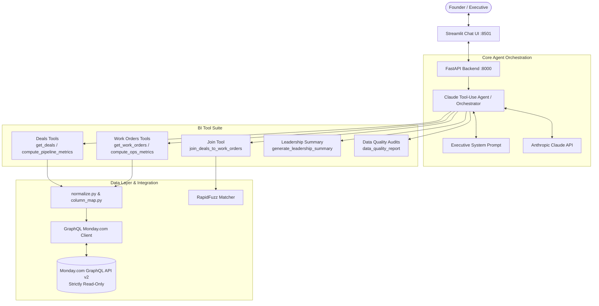
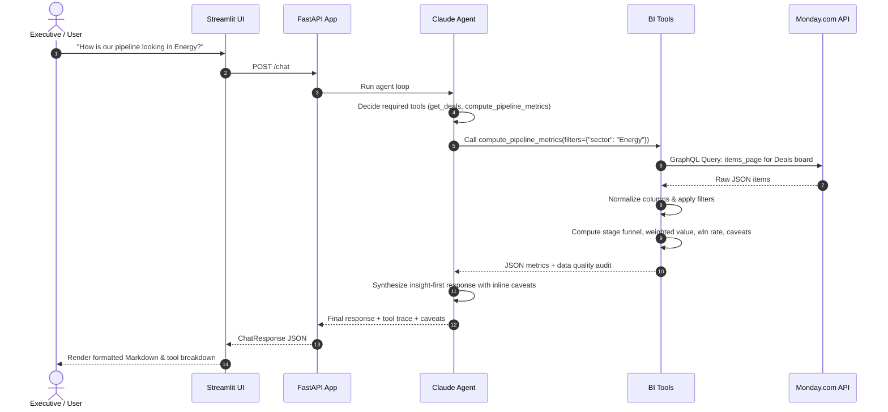

# 🏗️ Monday.com BI Agent — Architecture & System Design

A conversational Business Intelligence agent engineered to answer founder/executive-level questions by reading live data directly from **Monday.com** boards (**Deals** and **Work Orders**), performing resilient on-the-fly data cleaning, computing analytical metrics, linking disparate boards via fuzzy matching, and delivering insight-first answers with explicit data-quality caveats.

---

## 1. High-Level System Architecture

---

## 2. Component Specifications

### 2.1 Backend (`app/main.py`)
- Built on **FastAPI** with asynchronous request processing.
- Exposes:
  - `GET /health`: Dynamic health check testing authentication and board connectivity for both Deals and Work Orders boards with item counts.
  - `POST /chat`: Primary conversational endpoint routing user queries to the agent loop.
  - `POST /chat/stream`: Server-Sent Events (SSE) streaming for real-time tokens and tool events.
  - `POST /leadership-summary`: Structured briefing generation endpoint.
  - `GET /schema`: Active column maps and schema inspector.

### 2.2 Claude Agent Orchestrator (`app/agent.py`)
- Powered by Anthropic Claude via the `anthropic` Python SDK.
- Implements tool-calling loop:
  1. Accepts user query and conversation history.
  2. Submits message to Claude alongside JSON tool definitions.
  3. Receives `tool_use` calls, executes respective async Python functions, and feeds back structured JSON `tool_result` payloads.
  4. Continues until Claude generates the final executive answer.
  5. Implements self-healing error recovery (capped at 2 retries per tool call).
  6. Includes intelligent deterministic fallback mode when API keys are not supplied.

### 2.3 Shared Normalization Engine (`app/normalize.py`)
- Independent, pure Python library ensuring reliable data ingestion:
  - **`parse_date_any`**: `dateutil`-based multi-format parser (DD/MM/YYYY, MM-DD-YY, text months, ISO). **Invariable rule**: Never defaults silently to today; unparseable dates return `None` and are logged in data quality reports.
  - **`clean_number`**: Strips currency signs (`$`, `€`, `£`, `₹`), commas, percentages, and multipliers (`k`, `M`, `B`). Returns `None` (not 0.0) if unparseable.
  - **`normalize_sector`**: Canonicalizes sector strings (e.g. "Renewables" -> "Energy", "Fintech" -> "Financial Services"). Unmapped values bucket into `"Unspecified"` with audit tracking.
  - **`normalize_client_name`**: Strips corporate/legal designations (`Ltd`, `Pvt Ltd`, `Inc`, `Corp`, `LLC`, `LLP`, `Co.`), punctuation, and collapses whitespace for exact and fuzzy matching.

### 2.4 Monday.com GraphQL Client (`app/tools/monday_client.py`)
- Direct HTTP requests to `https://api.monday.com/v2` using `httpx.AsyncClient`.
- Features:
  - Strictly read-only queries (`items_page`, `boards`, `columns`).
  - Cursor-based pagination with automatic exhaustion of `next_items_page`.
  - Exponential backoff retry logic (up to 3 attempts) for network resilience and rate limits.
  - Command-line interface: `python -m app.tools.monday_client --dump-schema --board-id <id>`.

### 2.5 Cross-Board Fuzzy Matcher (`app/tools/join_tools.py`)
- Performs multi-stage linking of Deals and Work Orders:
  1. Normalizes client names on both sides.
  2. **Phase 1**: Exact string match -> High-Confidence Match (100%).
  3. **Phase 2**: RapidFuzz token sort/set ratio (threshold >= 90%) -> Medium-Confidence Match.
  4. **Preservation**: Unmatched deals and work orders are never discarded; they are returned in separate lists with counts and linkage percentages.

---

## 3. Data Flow & Execution Sequence

---

## 4. Error Handling & Safety Guarantees

1. **Read-Only Invariant**: No write queries (`mutation { ... }`) exist in the codebase.
2. **Missing Data Transparency**: Missing dates, numbers, or probabilities are counted and presented as explicit caveats rather than silently filled with zeros or today's date.
3. **Partial Availability**: If one board fails to load, the `/health` endpoint and tools return partial results with degraded status warnings rather than crashing the system.

